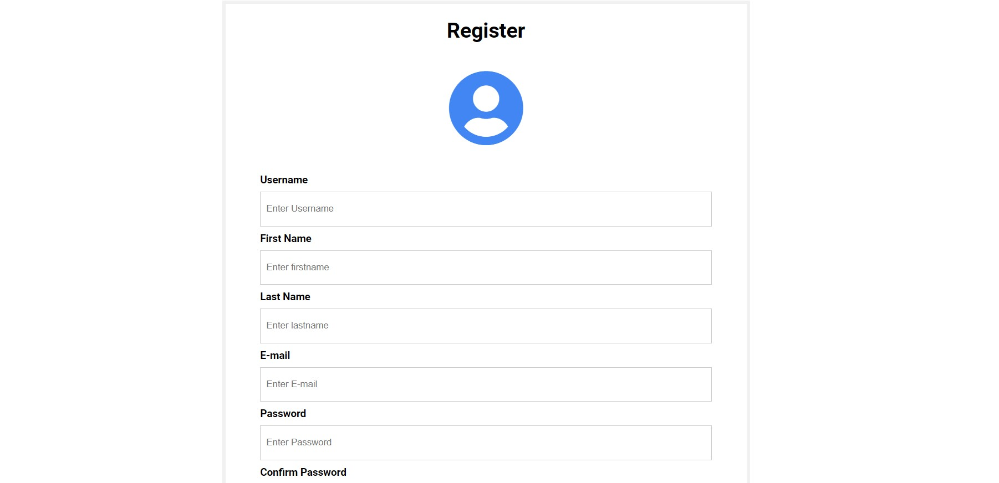
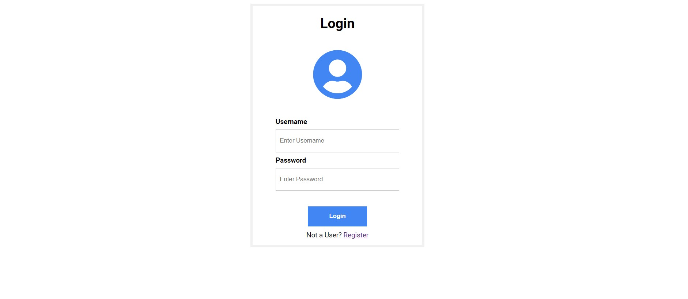
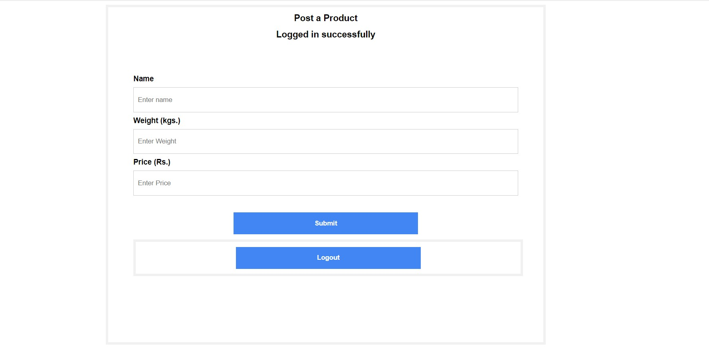

# Product Registration App

## Steps to run the project:
	
**Requirements:** Python and pip must be installed in your system.

### 1) Clone the project onto your local machine.

	git clone https://github.com/shivendushukre/Tradexa-Assignment.git

### 2) Create a virtual environment and install the required packages.

create a virtual envirnoment:

	virtualvenv venv

activate this virtual envirnoment:

	venv\Scripts\activate

installing all required packages which are present in requirement.txt:

	pip install -r requirements.txt

### 3) Start the development server:

	python manage.py runserver

## User Interface of the platform:
### 1) Register

### 2) Login

### 3) Add Product

